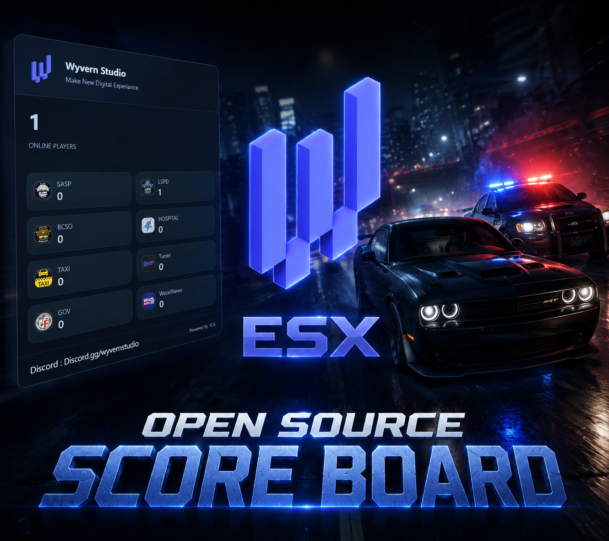
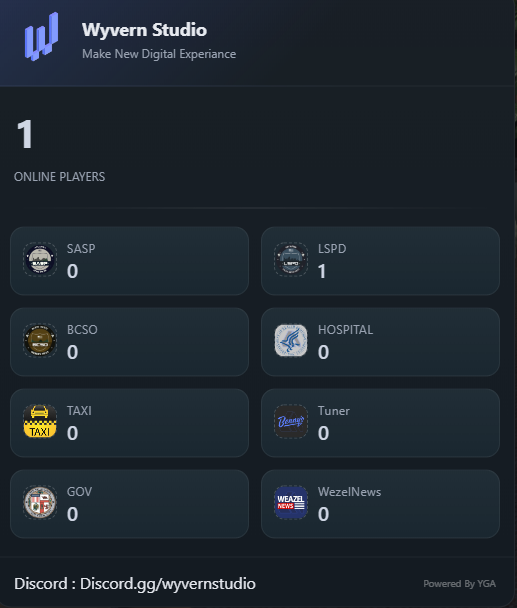

# 📊 Wyvern Studio - Open Source Scoreboard (ESX)

<p align="center">
  
</p>

Welcome to the **Wyvern Studio Scoreboard**, a modern, clean, and high-performance scoreboard script for FiveM servers running the **ESX Framework**. Designed with a focus on "New Digital Experiences," this scoreboard provides real-time player statistics and job counts with a sleek UI.

---

## ✨ Features
- 🚀 **High Performance:** Optimized code with low resmon (idle/active).
- 🎨 **Modern UI:** Clean and dark-themed interface for better visibility.
- 👥 **Job Counters:** Real-time tracking for:
  - 👮 Police (LSPD / SASP / BCSO)
  - 🚑 EMS / Hospital
  - 🚕 Taxi & Mechanics
  - 🏛️ Government (GOV)
  - 📰 Weazel News
- 🛠️ **Open Source:** Fully customizable and open for community improvements.
- 🔌 **ESX Ready:** Seamless integration with all ESX versions.

---

## 📸 Screenshots

<p align="center">
  
</p>

---

## 📥 Installation

1. **Download** the latest release from the [Releases](https://github.com/the-yga/Wyvern-ScoreBoard) page.
2. **Extract** the folder into your server's `resources` directory.
3. **Rename** the folder to `wy-scoreboard`.
4. **Add** the following line to your `server.cfg`:
```cfg
   ensure wy-scoreboard
   
